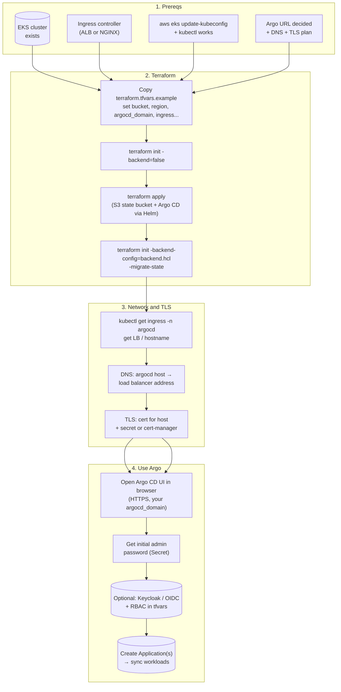
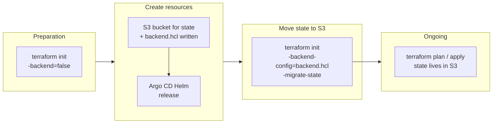
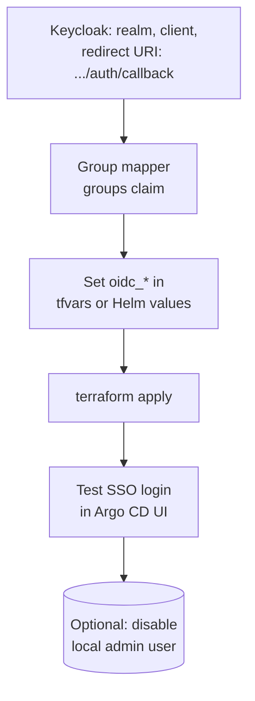

# Argo CD on EKS — deployment flow (diagrams)

Text runbooks: [eks-deploy.md](eks-deploy.md), [deploy-eks-keycloak.md](deploy-eks-keycloak.md). The diagrams below match this repo’s Terraform and typical EKS work.

> **Viewing the diagrams:** They use [Mermaid](https://mermaid.js.org/). GitHub, GitLab, many IDEs, and Notion render Mermaid. If you only see code blocks, paste into [Mermaid Live Editor](https://mermaid.live) or add a Mermaid extension to your viewer.

---

## 1) End-to-end: from prerequisites to a usable Argo CD

---

## 2) Terraform and state (first-time S3 path used by this repository)

This is the “bootstrap” loop: the bucket is created in the **same** apply that installs Argo; state starts **local**, then you **point** the backend at the new bucket and **migrate**.

---

## 3) Optional: UI login with Keycloak (after Argo is up)

---

## 4) Linear quick checklist (same story, one column)

If you need a **simple sequence** list without the boxes:

1. EKS + ingress + kubeconfig.  
2. `terraform init -backend=false` → `apply` → `init -backend-config=backend.hcl -migrate-state`.  
3. DNS to ingress LB, TLS in place, open Argo over HTTPS.  
4. (Optional) Keycloak client + `terraform` OIDC + RBAC.  
5. **Applications** in Argo to deploy your apps to the cluster (or more clusters).  

For command-level detail, use [eks-deploy.md](eks-deploy.md) first, then [deploy-eks-keycloak.md](deploy-eks-keycloak.md) for SSO.
